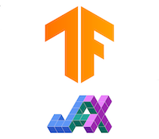

  

---

# TF_JAX_tutorials

Learn about TensorFlow and JAX but in a different way!

✅ Meant for everyone (from novice to advanced users)  
✅ Deep dive into the fundamental building blocks of the frameworks  
✅ Aim to improve your understanding and to some extent the mental model of the API  
✅ Not a typical  documentation-type tutorial  
✅ Runnable notebooks available    

:x: Not a replacement of the documentation

## TensorFlow

| Chapter No   | 
Topic
 | Colab | Kaggle | Binder | GitHub |
| ------------ | -----------------------------------  | ----- | ------ | ------ | ------ |
|  1.  | **Tensors**|  |  |  | |
|  2.  | **Variables**|  |  |  | |
|  3.  | **Automatic Differentiation and Gradients**|  |  |  | |
|  |   |  |  |  |  |

## JAX

| Chapter No   | Topic    | Colab | Kaggle | Binder | GitHub |
| ------------ | -------  | ----- | ------ | ------ | ------ |
|  1.  | **DeviceArray**|  |  |  | |
|  2.  | **Pure Functions**|  |  |  | |